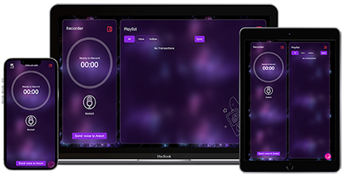

    <h1>AreonVoice</h1>
    <strong>Record what matter for ever</strong>
    

## AreonVoice
Record what matter for ever

## Problem

Some Times, Some Words would last forever:

A word to next generation

A truth that should shout out

A word to our loves

A word to whom we care about

## Solution
**AreonVoice** is a messaging app built on Areon blockchain using Node.js and React.

**AreonVoice** help you to easily at reasonable cost send an audio message to someone and keep it for ever on blockchain.

You want to send money for someone and need to attach your voice or simply want to say the beautiful thing to who you care about, just tap the mic buttons.

Say what you want. we will process and compress it more 95% using special algorithm. notice the cost of transaction depend on Areon blockchain.

Overall, the app offers a efficient way for users to record, compress and share their voice recordings using the Areon blockchain.

**AreonVoice** don't charge you at all. all cost are network fee.

## Process
- Connect your Metamask Wallet (Note : Set your Metamask Network to Areon Network Testnet/Mainnet)
- Record your voice and tap send
- Enter address of who you want to received your voice.
- Enter transaction amount, it can be 0, in this case you only pay for network fee.
- Tap the send button, to send it over blockchain
- All chat can be seen in inbox

## Adding Areon Network Testnet to MetaMask manually
1- Open MetaMask in your browser and click on the Ethereum network.

2- Click Add Network.

3- Click Add a network manually.

4- Fill out the network details form. To add a custom network you need the following details:

**Testnet**    

    Network Name: Areon Network Testnet
    
    New RPC URL: https://testnet-rpc.areon.network
    
    Chain ID: 462
    
    Currency Symbol: TAREA
    
    Block Explorer URL: https://areonscan.com

**Mainnet**    

    Network Name: Areon Network Mainnet
    
    New RPC URL: https://mainnet-rpc.areon.network
    
    Chain ID: 463
    
    Currency Symbol: AREA
    
    Block Explorer URL: https://areonscan.com
    
5- Once you fill out all the details, click Save.

6- Now you can switch to Areon Network Testnet.

## Further Improvement
We have some great ideas for next steps like:

-  Offer Voice wave NFT
-  Optimizing compressing process for file with music
-  Encrypting data for private message
-  WALL: a place for public messages
-  Offering options for play area like different theme based on context or voice to text
-  Send user message with appealing voice

## Getting Started with AreonVoice BackEnd

In the project directory, you can run:

``
cd bin
``

``
node www
``

Runs the app in the development mode.\
it run on [http://localhost:800].

## Getting Started with AreonVoice FrontEnd

This project was bootstrapped with [Create React App](https://github.com/facebook/create-react-app), using the [Redux](https://redux.js.org/) and [Redux Toolkit](https://redux-toolkit.js.org/) template.

### Available Scripts

In the project directory, you can run:

``
npm start
``

``
npm run build
``

Builds the app for production to the `build` folder.\
It correctly bundles React in production mode and optimizes the build for the best performance.

The build is minified and the filenames include the hashes.\
Your app is ready to be deployed!

## Demo
The app demo can be found in:
[DEMO](https://app.areonvoice.xyz)

